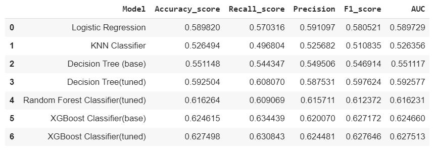

This repository contains my approach on Churn prediction challenge at KPMG DxA Olympics Final Round.
The task is:

- Complete an explanatory data analysis on Telecommunication Churn Data

- Build a model to estimate whether a new customer will churn or not

## Dataset

Because of confidentiality of the data provided by KPMG Turkey, I could not publicly release it but if you want to access the data please reach me at cesur.oe@gmail.com

Summary of the data:

- Customer churn can be defined as the rate at which the customer leaves and potentially chooses another business within the sector.

- We have a telecommunication data of 50079 unique individuals with 99 features about customers and 1 binary churn variable.

- You can see definitions of the all the features at 'churn_metadata.csv'. Broadly, the dataset includes data about usage (mean number of calls, SMS, internet usage etc.),
revenue from different services etc., customer characteristics (tenure, family members, current handset, location, income etc.)

- In data cleaning:
  - Features with a less than 0.005 point correlation to churn variable is dropped.
  
  - To be able to use categorical variables in classification models, we need to create dummy variables for each class of each categorical variable. 
  This process will increase number of features but they will be sparse vectors so, they won't slow down the training significantly.
  
  - For observations with missing features we can either drop them or interpolate to fill them.
  I tried both with interpolation and dropping and analysis does not differ significantly so, I choose to drop missing values and end up 33530 unique customers.
  
## Explanatory Data Analysis

- The dataset is balanced in churn variable meaning the number of customers churn is approximately 50% of the data even after dropping the data points with missing values.
This is not a usual scenario for churn data because one would expect to see smaller percent of churn (around 20%).

- When we look at the number of people churning vs not churning with respect to number of years they are using the service (tenure), We see that users with tenure of less than one year churn less
whereas users with a tenure between 1-2 years seem to churn more. This could be because of the binding subscriptions typically lasts 12 months or 24 months.

- Churning with respect to number of subscribers in the household gives us that there are more churning customers if number of subscribers is 2 which does not make a clear sense at first.

- Churning with respect to age of the equipment shows that people with equipment of 2 years have a higher churning ratio which can also be related to construction of subscriptions.

- Kernel Density Estimation plots will say us the most likely region of the possible new data points. Conclusions:
  - Customers who churn have the highest probability of occurring between 10 to 20 months of tenure.
  
  - Distribution of monthly charges and total charges does not give extra information on churning vs not churning.
  
  - Customers with current handset price less than 100 is more likely to churn than customers between 100-200.
  
 
  
  ## Models
  
  Following table shows the performance of the different models. Tuned meaning hyperparameter tuning is done after finding best parameters through grid search or random search.
  
  As we can see random forest model and Xgboost model have very similar succes and xgboost with hyperparamater tuning has best F1 score and AUC score of 0.6275
  
  
  
  
  
  References
  
  Through eda and models, the following analyses were especially helpfull to me:
  
  - https://towardsdatascience.com/customer-churn-analysis-eda-a688c8a166ed
  
  - https://www.kaggle.com/pavanraj159/telecom-customer-churn-prediction/notebook
